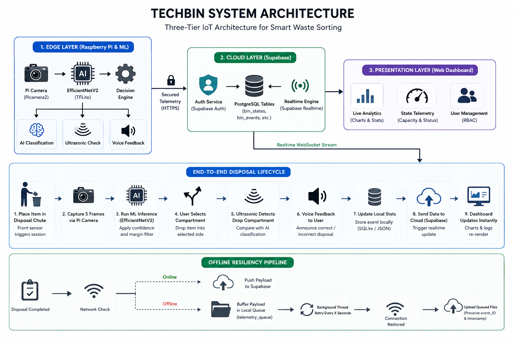

# TechBin: Smart AI-Based Waste Management System

TechBin is an end-to-end, IoT and AI-driven smart waste management system designed to classify, sort, and monitor waste disposal in real time. It consists of two primary components working in tandem:

1. **`techbin-ml-hardware` (Raspberry Pi Edge Device)**: A Python-based IoT application deployed on the physical waste bins, utilizing a camera, ultrasonic sensors, and an **EfficientNetV2 TFLite** machine learning model to classify and validate waste types locally.
2. **`techbin-app` (Web Dashboard)**: A modern web panel built with React, TypeScript, and Tailwind CSS, powered by **Supabase**. It provides real-time telemetry, live analytics, user management, and role-based access control.

---

## System Architecture & Data Flow



---

## Demo System Video


---


## 📂 Repository Structure

```text
/
├── techbin-app/               # React & Tailwind Web Application (Frontend + Supabase Configuration)
│   ├── src/                   # React components, features, and routing
│   ├── supabase/              # SQL schemas, migration scripts, and edge functions
│   ├── setup.sh & setup.bat   # Automated configuration and dependency bootstrap scripts
│   └── package.json           # Frontend dependency manifest
│
└── techbin-ml-hardware/       # Python Edge Application (Raspberry Pi & ML Inference)
    ├── app/                   # Pi sensor pipelines, camera captures, telemetry upload, and ML
    ├── tests/                 # Unit tests & pipeline validation scenarios
    ├── logs/                  # Offline queue directory and operational logs
    └── docs/                  # Hardware guides and development documentation
```

---

## 💻 Part 1: TechBin Web Dashboard (`techbin-app`)

The **TechBin Dashboard** provides administration, telemetry reporting, and role-based access control for managing the smart waste bins.

### Tech Stack
* **Frontend**: React (v18), TypeScript, Vite, Tailwind CSS.
* **Backend & Database**: Supabase (PostgreSQL, Realtime subscriptions, Edge Functions, Auth).

### Core Features
* **Role-Based Access Control (RBAC)**: Admin and Viewer roles. Only Admins can register new users, configure settings, and manage hardware nodes.
* **Real-time Telemetry Dashboard**: Subscribes to live Supabase updates to show current capacity (fill levels), bin temperature, gas levels, and fault logs.
* **Analytics**: Interactive graphs highlighting recycling efficiency and sorting correctness.
* **Permanent Super Admin**: Configured to bootstrap `admin@techbin.com` with complete administrator permissions.

### Setup and Local Execution

1. **Configure Environment Variables**:
   In `techbin-app`, create a `.env.local` file from `.env.example` and populate it with your Supabase credentials:
   ```env
   VITE_SUPABASE_URL=https://your-supabase-project.supabase.co
   VITE_SUPABASE_ANON_KEY=your-anon-public-key
   ```

2. **Run Dependency Setup**:
   Use the automated setup scripts (runs package checks, installs dependencies, and runs a test build):
   * **macOS / Linux**:
     ```bash
     cd techbin-app
     chmod +x setup.sh
     ./setup.sh
     ```
   * **Windows (Command Prompt)**:
     ```cmd
     cd techbin-app
     setup.bat
     ```

3. **Start the Frontend Development Server**:
   ```bash
   ./setup.sh dev
   ```
   Open [http://localhost:5173](http://localhost:5173) in your browser.

4. **Initialize Database Schema**:
   Apply `supabase/schema.sql` to your Supabase project using the SQL Editor to set up tables, RLS (Row Level Security) policies, and functions.

---

## ⚙️ Part 2: TechBin ML & Hardware (`techbin-ml-hardware`)

Deployed on a Raspberry Pi, this module controls sensors, runs on-device deep learning inference to identify rubbish categories, and publishes statistics.

### Tech Stack & Dependencies
* **Core Runtime**: Python 3
* **Inference Engine**: TensorFlow Lite (TFLite)
* **Hardware Drivers**: Picamera2, RPi.GPIO (for ultrasonic sensors, switches, and future actuators)

### Core Features
* **EfficientNetV2 AI Classifier**: Runs a local, low-latency `.tflite` model classifying waste into 5 categories: `cardboard`, `paper`, `plastic_glass`, `metal`, and `trash`.
* **5-Frame Average & Margin Validation**: Takes 5 frames from the Picamera2 RGB888 buffer, averages scores, and verifies that the prediction exceeds a minimum confidence threshold (`0.60`) and margin threshold (`0.12`) before accepting.
* **Ultrasonic Side Confirmation**: Confirms if the item was successfully dropped and validates whether it landed on the correct side (e.g., recyclable side vs. non-recyclable side).
* **Robust Telemetry Uploader**: 
  * Ingests bin states to Supabase.
  * **Offline Queue & Resiliency**: If internet connectivity is interrupted, telemetry payloads are queued locally in `logs/telemetry_queue/`. When connection is restored, the daemon retries uploading while preserving the original `eventId`.

### Required Environment Variables

Set the following variables on the edge device environment:
```bash
# Supabase Cloud Configuration
export TECHBIN_SUPABASE_URL="https://your-supabase-project.supabase.co"
export TECHBIN_ORG_ID="techbin"
export TECHBIN_BIN_CODE="BIN-001"
export TECHBIN_DEVICE_TOKEN="your_device_authentication_token"
export TECHBIN_SUPABASE_TIMEOUT_SECONDS="10"

# Model Location
export TECHBIN_MODEL_PACKAGE_PATH="/path/to/techbin_effnetv2_pi_test_package"
export TECHBIN_MODEL_VERSION="techbin-effnetv2-v1"

# (Optional) Prediction Thresholds
export TECHBIN_REAL_MIN_CONFIDENCE="0.60"
export TECHBIN_REAL_MIN_MARGIN="0.12"
```

### Running the ML Hardware Pipeline

* **To run a single real-device disposal session (production telemetry mode)**:
  ```bash
  PYTHONPATH=. python3 -m app.main_real_device --telemetry-mode upload_or_queue --json
  ```
  *This executes the full physical loop: front-session trigger -> side baseline check -> wait for item -> camera frame capture -> EfficientNetV2 prediction -> manual drop detection on side -> voice feedback generation -> state/event log -> upload to Supabase.*

* **To run tests / dry runs (mock mode)**:
  ```bash
  python3 -m app.main_runtime
  # OR
  python3 -m app.main_manual
  ```

* **To run unit tests**:
  ```bash
  PYTHONPATH=. python3 tests/test_supabase_real_pipeline.py
  ```

---

## 🤝 How They Integrate (Disposal Loop)

1. **Detection**: An object is placed into the TechBin physical compartment.
2. **AI Inference**: The Raspberry Pi camera captures the object and passes it to the `EfficientNetV2` classifier to predict the waste type.
3. **User Selection & Voice Feedback**: The user manually selects which compartment to drop the item in. The side ultrasonic sensors detect where the item was dropped, and the system plays voice feedback announcing whether it was a correct or incorrect disposal.
4. **Data Sync**: The Pi uploads a telemetry payload containing updated fill levels, temperature, and the specific `latestEvent` metadata to Supabase.
5. **Dashboard Refresh**: The React Dashboard (`techbin-app`) receives the change stream via Supabase Realtime, immediately updating the telemetry cards, charts, and log lists without needing page reloads.
