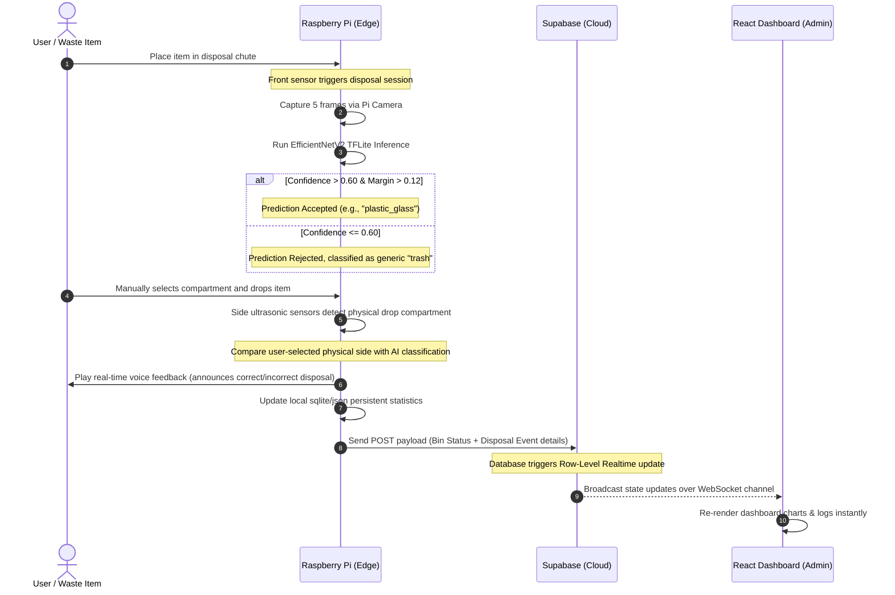

# TechBin: Comprehensive System Architecture & Engineering Design

This document provides a detailed description of the end-to-end system architecture of **TechBin**, explaining how the physical hardware, machine learning model, cloud database, and web dashboard interact.

---

## 1. Architectural Overview

TechBin uses a **Three-Tier IoT Architecture** to achieve low-latency edge classification, reliable data transport, and real-time visualization.

```
+-----------------------------------------------------------------------------------+
| 1. EDGE LAYER (Raspberry Pi & ML)                                                 |
|                                                                                   |
|  [Picamera2] ---> [EfficientNetV2 TFLite] ---> [Decision Engine]                  |
|                           |                           |                           |
|                           v                           v                           v
|                 (AI Classification)          (Ultrasonic Check)           (Voice Feedback)
+---------------------------------------+-------------------------------------------+
                                        |
                         (Secured Telemetry Stream via HTTPS)
                                        |
                                        v
+-----------------------------------------------------------------------------------+
| 2. CLOUD DATABASE & LOGIC LAYER (Supabase)                                        |
|                                                                                   |
|  [Auth Service] --------> [PostgreSQL Tables] <-------- [Realtime Engine]         |
|                       (bin_states, bin_events, etc.)           |                  |
+----------------------------------------------------------------|------------------+
                                                                 |
                                                    (Realtime WebSocket Stream)
                                                                 |
                                                                 v
+-----------------------------------------------------------------------------------+
| 3. PRESENTATION LAYER (React & Tailwind Web Dashboard)                            |
|                                                                                   |
|  [Live Analytics] <------ [State Telemetry Cards] <------ [User Management]       |
+-----------------------------------------------------------------------------------+
```

---

## 2. Component Design & Technical Details

### A. The Edge Layer (`techbin-ml-hardware`)
Deployed directly on the smart bin hardware (e.g., Raspberry Pi 4), this layer interacts directly with the physical world.

1. **Sensors & Input Peripherals**:
   * **Pi Camera (RGB888)**: Captures images of the discarded waste item inside the chute.
   * **Ultrasonic Distance Sensors**:
     * *Capacity Detection*: Measures distance to the heap of waste to calculate the remaining storage percentage.
     * *Disposal/Drop Confirmation*: Detects distance changes when an item passes through the chute to confirm the drop.
   * **Metal Sensor (Inductive Proximity)**: Optionally checks if the discarded object is metallic (enabling local GPIO validation).

2. **Edge Machine Learning Inference (EfficientNetV2)**:
   * Uses **TensorFlow Lite (TFLite)** to run model predictions on the Pi's CPU.
   * **Image Preprocessing**: Frame pixels are loaded as RGB, channels corrected, scaled, and normalized to range `[0..255]`.
   * **Decision Filtering (Confidence & Margin)**:
     * *Confidence*: The top class prediction must meet a minimum confidence score (default `0.60`).
     * *Margin*: The difference between the highest class probability and second highest probability must exceed `0.12`. This filter filters out blurry or ambiguous objects.
     * *Average*: Standardizes prediction by taking the average of 5 consecutive camera frames.

3. **Voice Feedback Module**:
   * Uses local audio output on the Raspberry Pi to play real-time voice feedback to the user.
   * Compares the user's manual choice of compartment (detected via ultrasonic/side sensors) with the AI's classification and plays a vocal confirmation (e.g., confirming correct or incorrect disposal).

---

### B. The Cloud Layer (Supabase Database & Realtime API)
Supabase serves as the relational and event-driven backend for the ecosystem.

1. **Database Tables**:
   * **`bin_states`**: Holds the current health metrics and operational status of each active physical bin.
     ```sql
     -- Key Columns:
     -- bin_code (Primary Key)
     -- status (active, offline, full, fault)
     -- fill_level (combined sensor data)
     -- temperature / gas_level
     -- last_heartbeat
     ```
   * **`bin_events`**: Holds log records of every disposal.
     ```sql
     -- Key Columns:
     -- event_id (Primary Key)
     -- bin_code (Foreign Key)
     -- classified_as (cardboard, plastic, etc.)
     -- disposed_side (recyclable, non_recyclable)
     -- is_correct_disposal (boolean)
     -- timestamp
     ```

2. **Realtime Channels**:
   * Enables client-side WebSockets. Any new row insert in `bin_events` or update to `bin_states` triggers an instant event push to the connected web clients.

3. **Auth & Edge Functions**:
   * Manages dashboard user registration, authentication tokens, and API requests securely.

---

### C. The Presentation Layer (`techbin-app`)
A responsive React dashboard designed for facility managers and administrators.

1. **Live Telemetry & Capacity Cards**:
   * Displays fill levels, active faults, and current operational states.
2. **Interactive Analytics Charts**:
   * Uses graphical charts to display total volumes sorted, incorrect disposal rates, and recycling ratios over time.
3. **Role-Based Access Control (RBAC)**:
   * **Super Admin**: Full database capabilities and dashboard creation.
   * **Viewer**: Read-only visualization access.

---

## 3. End-to-End Working Lifecycle (Disposal Session)

The sequence below outlines what happens when an item is placed in the bin:



---

## 4. Offline Resiliency Pipeline (Edge Storage & Recovery)

Because physical bins are often located in environments with unstable Wi-Fi, the Edge Layer implements an **Offline Queue System**:

```
[Disposal Completed]
         |
         v
[Network Check] --- (Online) ---> [Push Payload directly to Supabase]
         |
      (Offline)
         |
         v
[Buffer Payload in logs/telemetry_queue/event_ID.json]
         |
         v
[Background Thread: Retrying upload every X seconds]
         |
   (Connection Restored)
         |
         v
[Upload queued file preserving original event_ID & timestamp]
```
This guarantees that **no statistics are lost** during cellular or Wi-Fi dropouts, and historical charts remain correct.
