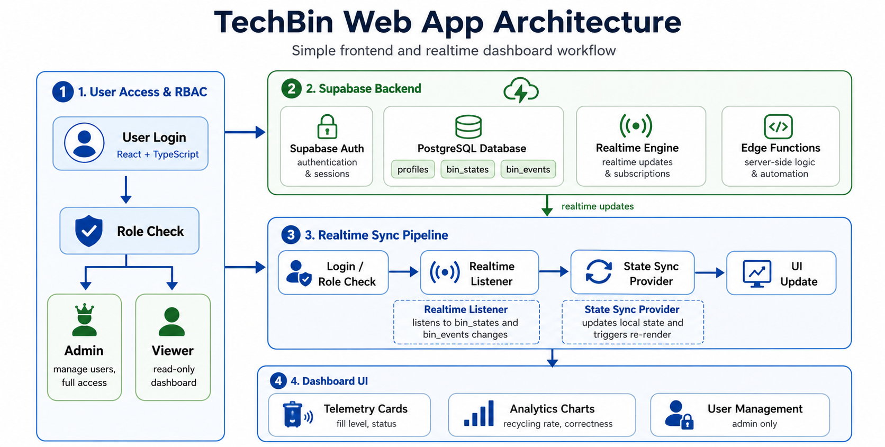

# TechBin: Web App Architecture & Frontend Pipeline

This document describes the design, components, and real-time data sync pipeline of the **TechBin Web Dashboard (`techbin-app`)**.

---

## 1. Core Technology Stack
* **Frontend Library**: React (v18) with TypeScript
* **Build System**: Vite (fast module bundling and hot module replacement)
* **Styling**: Tailwind CSS & PostCSS
* **Backend Services**: Supabase
  * **Supabase Auth**: Password-based login and token management.
  * **Supabase Database**: PostgreSQL for persistent tables.
  * **Supabase Realtime**: WebSocket-based broadcast channels for real-time table modifications.
  * **Supabase Edge Functions**: Serverless TypeScript APIs for admin tasks.

---

## 2. Web Application Lifecycle & Data Pipeline



---

## 3. Detailed Pipeline Stages

### Stage 1: Authentication & Role-Based Access Control (RBAC)
1. **User Sign-In**: The user signs in via the React frontend using email and password.
2. **Profile Creation & Sync**: 
   * On first login, a postgres trigger or edge function checks the user's role in the `profiles` table.
   * If logging in as `admin@techbin.com`, the app calls the `bootstrap-admin-profile` edge function to elevate the profile to a Super Admin role.
3. **Route Guards**: React Router dynamically filters routes. Admin pages (e.g., User Management, Bin Configuration) are hidden and blocked for users with the `Viewer` role.

### Stage 2: Real-time Ingestion & Dashboard Synchronization
1. **Realtime Listener**: On dashboard mount, the React application initializes a Supabase client listener:
   ```typescript
   supabase
     .channel('schema-db-changes')
     .on('postgres_changes', { event: '*', schema: 'public', table: 'bin_states' }, payload => {
        // Update specific bin capacity / fill levels in local React state
     })
     .on('postgres_changes', { event: 'INSERT', schema: 'public', table: 'bin_events' }, payload => {
        // Push the new disposal event into the live stream list
     })
     .subscribe();
   ```
2. **State Updates**: React Context/Providers capture the payload, merge it with existing data, and trigger component updates.

### Stage 3: Analytics Processing
* The analytics pipeline transforms raw event rows from the `bin_events` table:
  * **Recycling Rate**: Calculates the ratio of recyclable materials (`cardboard`, `paper`, `plastic_glass`, `metal`) to general waste (`trash`).
  * **Disposal Correctness**: Computes the percentage of disposals where the user-selected side matches the AI predicted classification (`is_correct_disposal == true`).
  * Charts automatically re-render when new records are pushed over WebSockets.

---

## 4. Directory Structure & Key Files

* **`src/app/`**: App bootstrapping, layouts, routes, and global providers.
  * **`providers/SupabaseProvider.tsx`**: Initializes the Supabase client and provides authentication context.
  * **`routing/AppRouter.tsx`**: Manages RBAC and protects admin-only paths.
* **`src/features/`**: Modular logic representing dashboard components.
  * **`dashboard/`**: Grid component displaying telemetry cards.
  * **`analytics/`**: Charts, stats processing, and graphing modules.
  * **`users/`**: Admin portal for registering and deleting user profiles.
* **`src/shared/`**: Helper files, UI components, and global configurations.
  * **`supabase.ts`**: TypeScript definitions automatically matched with the database schema.
* **`supabase/`**: Server-side configuration.
  * **`schema.sql`**: Database structure, constraints, indexes, and Row Level Security (RLS) policies.
  * **`functions/`**: Edge functions deployed to manage secure user creation.
