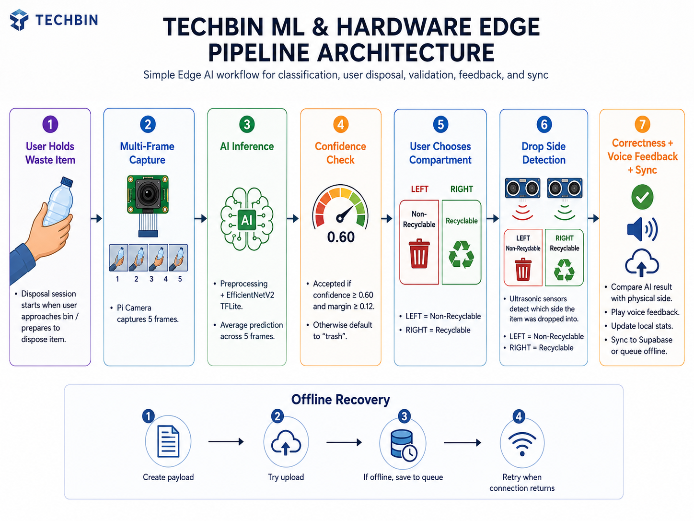

# TechBin: ML & Hardware Edge Pipeline Architecture

This document describes the design, ML pipelines, hardware interaction, and offline queuing system of the **TechBin Edge Application (`techbin-ml-hardware`)**.

---

## 1. Core Technology Stack & Hardware
* **Edge Device Platform**: Raspberry Pi (typically Pi 4 or equivalent)
* **Runtime**: Python 3
* **Edge AI Framework**: TensorFlow Lite (TFLite)
* **Hardware Interface**:
  * **Camera**: Raspberry Pi Camera Module (using `Picamera2`)
  * **GPIO Interface**: `RPi.GPIO` library (or equivalent mock wrapper for dry-runs)
  * **Ultrasonic Sensors (HC-SR04)**: Measures fill levels and validates drops
  * **Speaker**: Analog/USB audio output for local speech feedback

---

## 2. On-Device Execution Pipeline (Disposal Session)

---

## 3. Detailed Pipeline Stages

### Stage 1: Session Initialization & Image Capture
1. **Session Trigger**: An item entering the entry chute triggers the camera routine (optionally initiated via front IR/ultrasonic sensor).
2. **5-Frame Burst Capture**: The system captures 5 consecutive RGB888 preview frames using `Picamera2`. Capturing multiple frames mitigates errors caused by movement or glare.

### Stage 2: TFLite Preprocessing & AI Inference
1. **Preprocessing**:
   * Rectifies red/blue channels if required: `frame[:, :, [2, 1, 0]]`.
   * Resizes the frame dynamically based on `preprocessing_config.json`.
   * Normalizes values in the range `[0..255]`.
   * The current runtime preserves the red/blue channel swap used by the proven camera script; this must be physically validated on the deployed Pi Camera Module V2 before final submission.
2. **Inference**:
   * Feeds the tensor into the `EfficientNetV2` model engine (`app/ml/effnetv2.py`).
   * Averages prediction probabilities across the 5 frames.
3. **Threshold Filters**:
   * **Confidence Threshold (`0.60`)**: The highest prediction probability must be $\ge 0.60$.
   * **Margin Threshold (`0.12`)**: The difference between the highest probability class and the second highest probability class must be $\ge 0.12$. 
   * If both checks pass, the visual camera classification is accepted. If they fail, the item is labeled as generic `trash`.

### Stage 2A: Final Category Resolution
1. **Camera Categories**: The camera model supplies the visual prediction used as the original classification, such as `cardboard`, `paper`, `plastic_glass`, or `trash`.
2. **Metal Override**: When the physical metal detector override is enabled, healthy, and reports a valid metal hit, the final effective category becomes `metal` and `classificationSource` becomes `metal_sensor`.
3. **Original Prediction Preservation**: The Pi preserves the original camera prediction separately from the final effective category sent to Supabase.

### Stage 3: Manual Sorting & Ultrasonic Verification
1. **Drop Detection**: The user decides which compartment to place the item in and drops it.
2. **Ultrasonic Validation**:
   * Left and right ultrasonic sensors continuously monitor distance.
   * A spike in distance readings (from the calibrated baseline) confirms which side (Recyclable vs. Non-Recyclable) the item fell through.
3. **Correctness Evaluation**:
   * Final effective categories `cardboard`, `paper`, `plastic_glass`, and `metal` route to **Recyclable**.
   * Final effective category `trash` routes to **Non-Recyclable**.
   * `metal` is produced by the physical metal detector override, not by the camera model.
   * If the physical drop matches the category, it is marked as `correctDisposal = true`, otherwise `correctDisposal = false`.

### Stage 4: Voice Feedback
* Compares the classification vs. drop location:
  * If correct: Triggers local voice module to speak: *"Disposal Correct. Thank you for recycling!"*
  * If incorrect: Triggers: *"Incorrect compartment. Please drop recyclables in the recycling side."*

### Stage 5: Telemetry Sync & Offline Recovery
1. **Database Payload**: Prepares JSON containing current bin capacity percentages, event id, classification, drop compartment, correctness state, and timestamp.
2. **Sync Action**:
   * Attempts an HTTPS post using the secret device token to the Supabase client.
   * If request times out or returns network errors:
     * Saves payload to `logs/telemetry_queue/event_<timestamp>.json`.
     * Activates a background daemon thread that checks network connectivity and retries uploading queued files sequentially.
3. **Local Totals**: Updates `logs/supabase_totals.json` to keep track of total, correct, and incorrect disposal counts on-device.
